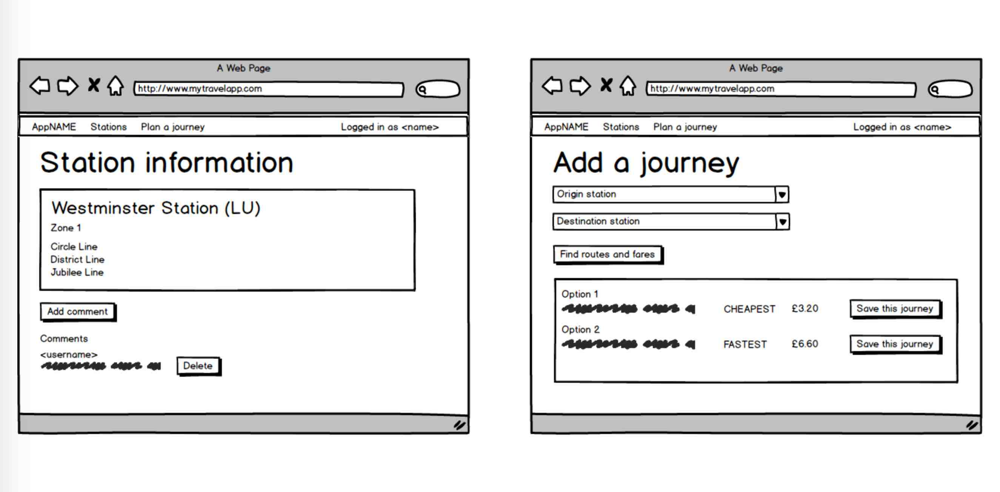

# Skedaddle

[See my other coding projects!](https://suze.dev/coding_projects/)


## Introduction

**After four weeks of learning JavaScript, I created my first full stack web application in just seven days.**

I decided to create an app which helps people who use [Transport for London (TfL)](http://tfl.gov.uk) services.


## Brief

The requirements for our app were to:

* Use **MongoDB**, **Express** and **Node.js** and therefore be **MEN stack**.
* Use **EJS** templates.
* Have **at least two RESTful resources**: one representing a user and one that represents the main resource of our app, for example books, films or restaurants.
* Have **complete RESTful routes** for at least one of the resources, with **all CRUD actions**.
* Include **relationships**: embedded or referenced.
* Include **authentication** with **encrypted passwords** and an **authorisation flow**.
* Design **wireframes** before building the app.
* Have **semantically clean HTML** that makes structural sense rather than thinking about how the pages look.
* Use **SCSS**.
* Be **deployed online** and accessible to the **public**.

We were also given some optional bonus tasks:

* **Include data from an external API.**
* Add **automated tests** for at least one of the RESTful resources.

I love a challenge and I love bonus tasks.  I love real-time information - especially travel information - and APIs even more.  So I jumped at the opportunity to incorporate live data from TfL in my app.

I was comfortable with RESTful resources, the CRUD actions and user authentication so I knew I would be able to complete these functions early in the week, freeing up valuable time to focus on pulling in and manipulating the API data.


## The app

I live in London and, if I can't walk or cycle somewhere, I use the Tube and buses as well as some National Rail services.

One of the things I have wanted to do for a long time is create an app which would allow the user to plan or define their route across as many service providers as needed, then save that route and receive status updates regarding their route.

However, after looking at the available API data, I decided that this was far too complicated for a minimum viable product (MVP) for this particular project, given I only had seven days in which to get everything done.

I therefore decided that, as TfL is the provider which delivers most of the journeys in Zones 1-3, I would focus on the London Underground (LU) only, and create my original idea as an MVP but have the status updates as a nice-to-have if I had time after reaching MVP.

Therefore, my MVP was to be an app where a user could create an account, log in, search for a journey and then save and delete the journey.


## Planning

Before programming anything, I wrote some pseudocode describing what I needed to happen.  This helped me to break everything down into a set of small problems.  For example:

* The user needs to be able to register an account by giving their e-mail address and a password.
* Once logged in, they should be able to specify an origin station and a destination.
* The app will take this information and make an AJAX request to the TfL API to gather the journey data.
* The app will display this data to the user, who can then decide which journey(s) they wish to save.
* The user can see a list of all their saved journeys and have a Delete button next to each one.

I also drew up some wireframes using [Balsamiq](https://balsamiq.com/).  These helped me to plan out how many views I needed to create, and the general layout of each one:




## Build and Development

This app is MEN Stack:

* **M**ongoDB to store the RESTful models.
* **E**xpress to organise the app, set up the controllers for the RESTful routes etc.
* **N**ode.js to run the JavaScript on the server side.

I also used EJS to create view templates.  This enabled me to avoid duplicating work and, together with the CSS, also ensured a consistent look and feel across the app.

The User model has a POST route for new members to create an account.  Once they have done that, they can log into the site - a process which is fully authenticated using bcrypt and JWT.

I decided that I wanted the appearance of the navbar to depend on whether or not a user was logged in.  Therefore I created a partial for the navbar and, within it, created an if... else statement to determine whether or not there was a user logged in.  If there was, then the navbar would greet them and, if not, it would invite them to register or log in:

```ejs
    <ul class="navbar-nav mr-auto">
      <li class="nav-item">
        <a class="nav-link" href="/stations">Station Info</a>
      </li>

      <% if (locals.isLoggedIn) { %>
        <li class="nav-item">
          <a class="nav-link" href="/journeyplan">Journey Planner</a>
        </li>

        <li class="nav-item">
          <a class="nav-link" href="/logout">Log out</a>
        </li>
      </ul>

      <ul class="nav-link navbar-nav navbar-right">
        <li class="nav-item loggedin">
          <a href="/users/<%= loggedInUser._id %>">
        Logged in as <%= locals.loggedInUser.firstname %> <%= locals.loggedInUser.lastname %>
          </a>
        </li>

        <li class="nav-item loggedin">
          <a class="nav-link" href="/logout">
        (Not <%= locals.loggedInUser.firstname %>?)
          </a>
        </li>

        <% } else { %>
          <li class="nav-item">
          <a class="nav-link" href="/login">Log In</a>
          </li>
          <li class="nav-item">
          <a class="nav-link" href="/register">Create an account</a>
          </li>
          <% } %>
```

The only things users can see if they are not logged into the app are the registration view, the login view and the list of London Underground stations.  All the other views (journey planner, station info etc) are locked down to logged-in users.

To build out the journey planner, I first started by creating inputs for the user to state their origin and destination.  However, I soon realised that the TfL API tries to be helpful by sending responses relating to close matches to the parameters sent with the AJAX request.  (See the [**Challenges**](#challenges) section for more details.)

I therefore seeded the station data into the app:

```javascript
    {
    name: 'Oxford Circus',
    latitude: 51.515224,
    longitude: -0.141903,
    lines: [
    {id: 'victoria', name: 'Victoria'},
    {id: 'bakerloo', name: 'Bakerloo'},
    {id: 'central', name: 'Central'}
    ],
    naptan: '940GZZLUOXC',
    zones: ['1'],
    streetAddress: 'Oxford Circus Station, London Underground Ltd., Oxford St, London, W1B 3AG',
    icsCode: '1000173'
    },
```

This had the added bonus that going through the API to pick out only the data I actually needed meant I was closely examining the datasets to see exactly what information they contained.

Because of this, given that I now had station data seeded into my database, I decided that I was going to add some extra functionality to my app.  So as well as allowing the user to plan and save their journey, I would also create some views which showed information about each station (which I already had in the seeds), as well as a live arrivals board (which I could populate by using the seed data to form part of an AJAX request to the API):

```javascript
$.get(`https://api.tfl.gov.uk/StopPoint/${station.naptan}/Arrivals`)
```


## Challenges

I had already used the TfL API on a [Boris Bike project](https://github.com/SuzeShardlow/Boris_Bikes) so I knew it was challenging to work with.  There are thousands of endpoints, which is great, and there is a [testing tool](https://api.tfl.gov.uk/swagger/ui/index.html) on their website so you can see examples of the data you'll receive in response to various requests.  However, there is very little in the way of written documentation, and when I was using the API during my course the testing tool did not work properly.

I encountered the following additional challenges during this project:

* When searching for journey data using the API, for example using the keyword "Westminster", one does not simply receive data relating to Westminster Underground Station.  The API returns information on any **place** with "Westminster" in its name.  Therefore, I was getting results including Westminster Gardens in Walthamstow.

* While looking for the most relevant endpoints for my needs, I realised that each station had two unique identifier codes: a **naptanId** and an **icsCode**.  However, after much time spent experimenting I realised that only the **icsCode** could be used to interrogate certain API endpoints.

To solve both these issues, I decided to seed the station data into my app and take the icsCode from there to make the AJAX requests for the real-time information.

When bringing in the Google Maps API for each station's Show page, I used the latitude and longitude information for that station as the centre point for the map.  However, by default, Google Maps shows information for all public transport hubs when you hover over them.  Therefore I needed to research a way to remove this functionality from the map (```clickableIcons: false```) so that the only station information on the view would be provided by my app.


## Bonus Functionality

As well as the TfL API, I also brought in the Google Maps API to show the location of each station on its Show page.


## Future Developments

I would still love to bring other providers' information into this app so that users (especially in South London!!!) can plan their actual journey, across all modes of transport and all providers, from end to end.

I would also love to bring in fare information to help people find the cheapest way of making their journey, as well as the quickest way.

I am currently creating an [Alexa skill](https://github.com/SuzeShardlow/alexa_skill_skedaddle) for London Underground arrivals using the TfL API.
